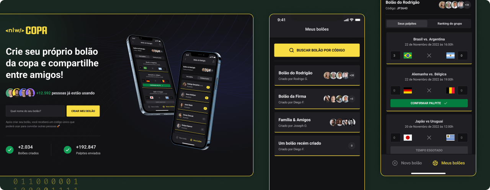
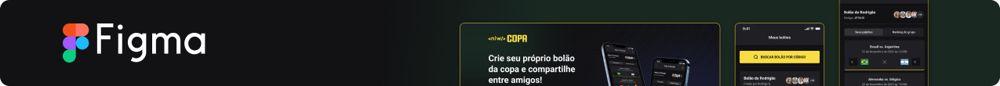

Projeto desenvolvido durante a Next Level Week Copa, consiste em uma aplicação para criar e participar de bolões da Copa do Mundo 2022.

## 📸 Preview

## 🤖 Tecnologias utilizadas

- [TypeScript](https://www.typescriptlang.org/)
- [React](https://reactjs.org/)
- [React Native](https://reactnative.dev/)
- [Expo](https://expo.dev/)
- [Fastify](https://www.fastify.io/)
- [Prisma](https://www.prisma.io/)
- E muitas outras…

## 🚀 Como executar

Em cada projeto tem a documentação informado oque é necessário e o passo a passo para executar a aplicação.

Acesse a documentação de cada projeto:

- [⚙ Backend](./server/)
- [🖥 Web](./web/)
- [📱 Mobile](./mobile/)

## 🖼 Layout 

Você pode visualizar o layout do projeto através do link abaixo:

## 🧑‍💻 Autores

<table>
  <tr>
    <td align="center">
      <a href="https://github.com/IgoCarvalho">
        
         
        
          <b>Igo Carvalho</b>
        
      </a>
       
      <a href="https://www.linkedin.com/in/igocarvalho/" title="LinkedIn" target="_blank">@igocarvalho</a>
    </td>
    <td align="center">
      <a href="https://github.com/rocketseat/" target="_blank">
        
         
        
          <b>Rocketseat</b>
        
      </a>
       
      <a href="https://www.rocketseat.com.br/" title="Rocketseat Website" target="_blank">@rocketseat</a>
    </td>
  </tr>
</table>

---

  Feito com 💜 por <a href="https://github.com/IgoCarvalho">Igo Carvalho</a>

