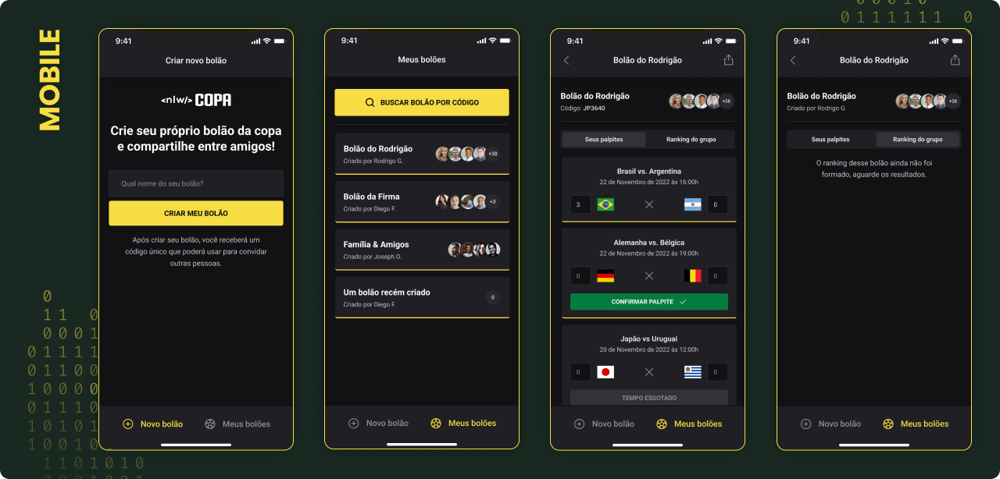

Projeto desenvolvido durante a Next Level Week Copa, consiste em uma aplicação para criar e participar de bolões da Copa do Mundo 2022.

## 📸 Screenshots



## 🤖 Tecnologias utilizadas

- [TypeScript](https://www.typescriptlang.org/)
- [React Native](https://reactnative.dev/)
- [Expo](https://expo.dev/)
- [Native Base](https://nativebase.io/)
- [Country List](https://github.com/umpirsky/country-list)
- [DayJS](https://day.js.org/)
- [Phosphor React Native](https://github.com/duongdev/phosphor-react-native)
- [Axios](https://axios-http.com/)

## 🚀 Como executar

Clone o repositório

```bash
git clone https://github.com/IgoCarvalho/nlw-copa.git
```

Entre na pasta do projeto

```bash
cd mobile
```

Instale as dependências

```bash
npm install
```

Execute o projeto

```bash
npm start
```

Pronto 🎉

## 🧑‍💻 Autores

<table>
  <tr>
    <td align="center">
      <a href="https://github.com/IgoCarvalho">
        
        <br />
        <sub>
          <b>Igo Carvalho</b>
        </sub>
      </a>
      <br />
      <a href="https://www.linkedin.com/in/igocarvalho/" title="LinkedIn" target="_blank">@igocarvalho</a>
    </td>
    <td align="center">
      <a href="https://github.com/rocketseat/" target="_blank">
        
        <br>
        <sub>
          <b>Rocketseat</b>
        </sub>
      </a>
      <br />
      <a href="https://www.rocketseat.com.br/" title="Rocketseat Website" target="_blank">@rocketseat</a>
    </td>
  </tr>
</table>

---

<p align="center">
  Feito com 💜 por <a href="https://github.com/IgoCarvalho">Igo Carvalho</a>
</p>
