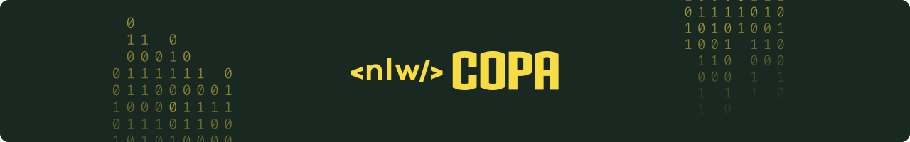

Projeto desenvolvido durante a Next Level Week Copa, consiste em uma aplicação para criar e participar de bolões da Copa do Mundo 2022.

## 🎲 Diagrama ER


## 🤖 Tecnologias utilizadas

- [TypeScript](https://www.typescriptlang.org/)
- [Node.js](https://nodejs.org/)
- [Fastify](https://www.fastify.io/)
- [Fastify Jwt](https://github.com/fastify/fastify-jwt/)
- [Prisma](https://www.prisma.io/)
- [Prisma ERD](https://github.com/keonik/prisma-erd-generator/)
- [Zod](https://github.com/colinhacks/zod/)
- [Dotenv](https://github.com/motdotla/dotenv/)

## 🚀 Como executar

Clone o repositório

```bash
git clone https://github.com/IgoCarvalho/nlw-copa.git
```

Entre na pasta do projeto

```bash
cd server
```

Instale as dependências

```bash
npm install
```

Crie as variáveis de ambiente, basta copiar o arquivo de exemplo que vem com o projeto, ele já vem as variáveis definidas, mas você pode alterar caso queira

```bash
cp .env.example .env
```

Execute as `migrations` do banco de dados

```bash
npx prisma migrate dev
```

Execute o projeto

```bash
npm run dev
```

Pronto 🎉

## 🧑‍💻 Autores

<table>
  <tr>
    <td align="center">
      <a href="https://github.com/IgoCarvalho">
        
        <br />
        <sub>
          <b>Igo Carvalho</b>
        </sub>
      </a>
      <br />
      <a href="https://www.linkedin.com/in/igocarvalho/" title="LinkedIn" target="_blank">@igocarvalho</a>
    </td>
    <td align="center">
      <a href="https://github.com/rocketseat/" target="_blank">
        
        <br>
        <sub>
          <b>Rocketseat</b>
        </sub>
      </a>
      <br />
      <a href="https://www.rocketseat.com.br/" title="Rocketseat Website" target="_blank">@rocketseat</a>
    </td>
  </tr>
</table>

---

<p align="center">
  Feito com 💜 por <a href="https://github.com/IgoCarvalho">Igo Carvalho</a>
</p>
